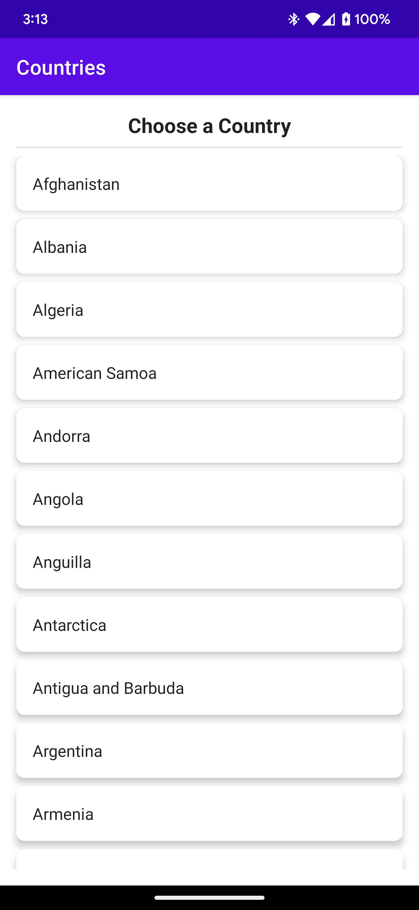

# Flexjet_Countries_App

This is a Android app that retrieves country details data from a REST API (https://restcountries.com/v3.1/name/%7Bcountry_name%7D) using Retrofit and displays it using Jetpack Compose. 
The app consists of two screens: a list of countries and a detailed view of a single country.

Libraries
The app uses the following libraries:

Retrofit for REST API calls
Jetpack Compose for UI
Navigation Compose for navigating between screens

Screenshots

